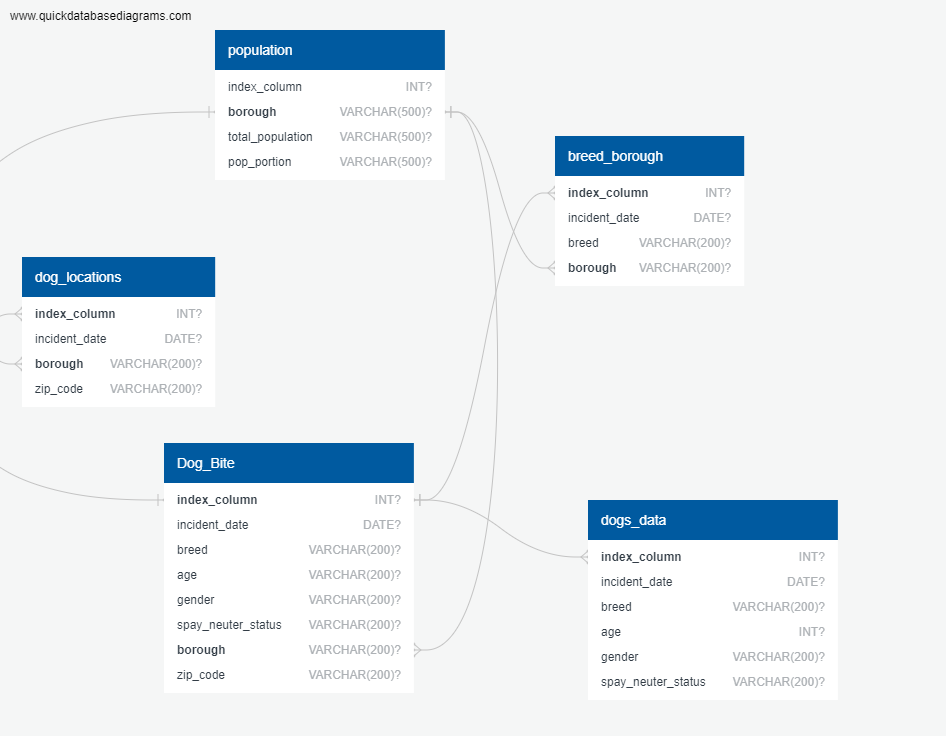

# Dog Bite Data: Project 3
### Objective / Description
Data Engineering Track
To analyze the number of dog bites reported in new york city boroughs between 2015 and 2022.

## Tables and Data
### SQL Files
SQL source file: [dog_bit_data_postgres](dog_bit_data_postgres.sql) (6 tables);

See Querys to determine the number of dog bites that occurred in the five main boroughs of new york city for the years 2015-2022, the count of breeds and incidences of dog bites by breed, comparison between population percentage and number of dogbites occurring in each borough, and the popularity of dog breeds in each borough.

See Folium Map to see total incidences of dog bites in each borough for each year.

See [ERD](ERD/QuickDBD-export.sql) folder for workflow diagram.

### Ethical Considerations
For our project, we needed to consider ethical use of data. We made sure to adhere to five main principles from the [United States Department of Commerce Data Ethics Framework](https://www.commerce.gov/sites/default/files/2023-02/DOC-Data-Ethics-Framework.pdf). Here are the main principles that we focused on:
* Privacy and Confidentiality
* Fairness and Inclusiveness
* Transparency and Accountability
* Safety and Security

The data that we used for this project was publicly available data, including the incidents of dog bites and the populations of boroughs (taken by census data). No personal data from individuals involved in the incidents was collected or used, thus maintaining the confidentiality of those involved. Our data lacked information about ethnicity, socioeconomic status (SES), or any other personal data that could be used to identify persons, but it's important to note that these incidents have a legal component to them. For this reason, we found it important to refrain from using data that could be used to identify persons. We were conscious about when to use zip codes versus borough and neighborhood names. Throughout our project, we had an objective that we wished to accomplish: process dogbite data using the ETL framework to make the data more useable for analysis. We made sure to keep that objective in mind for the purposes of transparency and self-accountability, not going beyond what our original intent with the data was. Finally, we were mindful of any adjustments made to data for cleaning purposes so that the data fully represented what occurred in the incident. Any alterations to the data maintained the factuality of the data, telling the full story of what happened. This was done by acknowledging bias that could occur, and making conscious efforts to avoid that bias.

## References and Citations
Dog Bite Data (https://catalog.data.gov/dataset/dohmh-dog-bite-data/resource/21d7bc57-e2a5-48e2-bf4b-10f13bea946b) *see dogbites JSON file 
NYC Population data *see nyc_pop JSON file

Folium starter code (https://python-visualization.github.io/folium/latest/getting_started.html)

Coding Assistance: course instructor, xpert learning assistant, stack overflow
       
   
